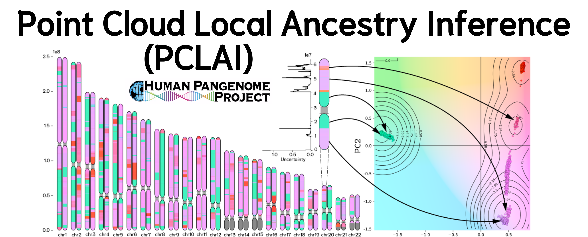

## Point Cloud Local Ancestry Inference (PCLAI) — HPRC Release 2

*Quick links:*
**Read the Manual:** [PCLAI Manual v.0.1](https://github.com/AI-sandbox/hprc-pclai/blob/main/pclai_manual.pdf) | **Reference PCA space (PC1–PC2 + metadata):** [Reference PCA Metadata](https://github.com/AI-sandbox/hprc-pclai/blob/main/reference_pca_metadata.tsv) | **Index files**: [GRCh38 - CHM13 - Assembly](https://github.com/human-pangenomics/hprc_intermediate_assembly/tree/main/data_tables/annotation/pclai)

PCLAI is a deep learning-based approach for inferring continuous population genetic structure along the genome. Instead of assigning each genomic window to a discrete ancestry label, PCLAI predicts a **continuous coordinate** (e.g., a point in PC1–PC2 space) for every window, together with a **per-window confidence score**.

---

### What PCLAI provides

For each genomic window (**1000 SNPs**), PCLAI outputs:

- **Continuous coordinates per window**  
  A low-dimensional coordinate (e.g., **(PC1, PC2)**) representing where that window lies in a reference genetic space.

- **Confidence score per window**  
  A value in **[0, 1000]** where **higher = more confident**. We filter out very low-confidence predictions in the distributed BED files.

PCLAI is naturally a regression method in a coordinate space. For HPRC Release 2, coordinates are reported in **PCA space** as a default surrogate for genetic distance.

---

## How HPRC Release 2 results were generated (high level)

1. **Reference embedding:** Construct a reference PCA embedding (from 1000 Genomes using the [Reference PCA Metadata](https://github.com/AI-sandbox/hprc-pclai/reference_pca_metadata.tsv)).
2. **Windows:** Split each haplotype into fixed windows of 1000 SNPs.
3. **Inference:** Predict a coordinate for each window in the reference PCA space.
4. **Confidence:** Output a confidence score per window for QC / filtering.

Discrete ancestry labeling is **optional**: you can bin coordinates into categories after the fact, but the primary output is continuous. If you require PCLAI discretization for downstream tasks, consult our [Manual](https://github.com/AI-sandbox/hprc-pclai/pclai_manual.pdf). 

If you require impainting missing windows for downstream tasks, refer to our recommendation in our [Manual](https://github.com/AI-sandbox/hprc-pclai/pclai_manual.pdf). 

---

## Output format (BED9)

We provide local ancestry results as **BED9**, which works well in genome browsers and supports interval coloring via `itemRgb`.

| Field        | Description |
| ------------ | ----------- |
| `chrom`      | Chromosome |
| `chromStart` | Window start (0-based, inclusive) |
| `chromEnd`   | Window end (0-based, exclusive) |
| `name`       | `{sample}/{hap}/{chrom}_wXXXX_(x,y)` where `(x,y)` are the predicted coordinates (e.g., `(PC1,PC2)`) |
| `score`      | **Confidence score** in **[0,1000]** (higher = more confident) |
| `strand`     | `.` |
| `thickStart` | equals `chromStart` |
| `thickEnd`   | equals `chromEnd` |
| `itemRgb`    | `R,G,B` color derived from the predicted coordinate (exported as RGB; generated from a perceptual mapping) |

Example BED9 row:
```txt
chr1    14486   805864  HG00097/h1/chr1_w0001_(0.438,-1.398)    991 .   14486   805864  222,162,255
```

**Visualization tip**: `itemRgb` lets you color each window by position in the embedding (e.g., mapping a 2D coordinate into a perceptual color space → RGB), so continuous shifts along the genome are visually apparent.


## Cite

When using the PCLAI method or PCLAI outputs, please cite the following paper:

```{tex}
@article{geleta_pclai_2026,
    author = {Geleta, Margarita and Mas Montserrat, Daniel and Ioannidis, Nilah M. and Ioannidis, Alexander G.},
    title = {Point-cloud local ancestry inference: coordinate-based ancestry along the genome},
    year = {2026}
}
```